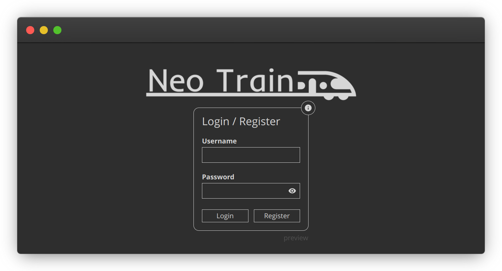
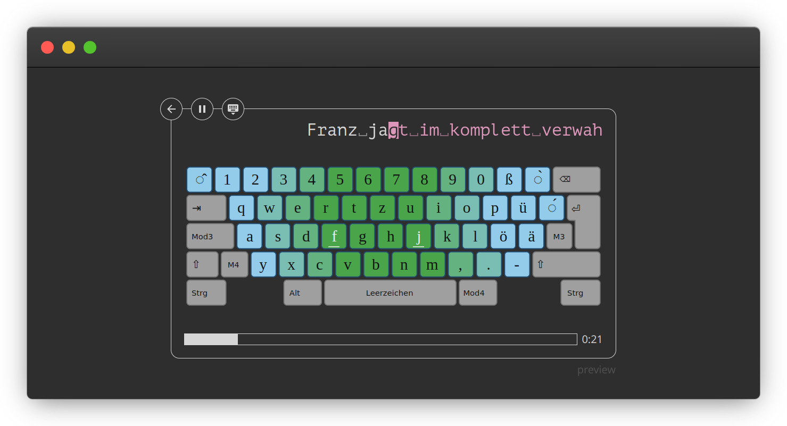

<div style="text-align: center">


</div>

[Neo Train](https://neo-train.lamdera.app/) is an online touch typing trainer for the [neo layout](https://www.neo-layout.org/). It is build with [lamdera](https://lamdera.com/), which uses [elm](https://elm-lang.org/). The Page supports the layouts Neo, Bone, NeoQwertz, AdNW, KOY, NeoQwerty, Vou and Mine. It has randomly generated lectures for each, as well as a couple of handwritten dictates.

## Screenshots




## Installation

You will need [lamdera](https://lamdera.com/) for running this app.
All dependencies will be downloaded automatically.

## Usage

To start a live debugging session, just start lamdera in the live mode inside the project folder.

```bash
lamdera live
```

## Contributing

Pull requests are welcome. For major changes, please open an issue first to discuss what you would like to change. Adding more dictates is also welcome.

There are no tests yet.

## License

[MIT](https://choosealicense.com/licenses/mit/)
